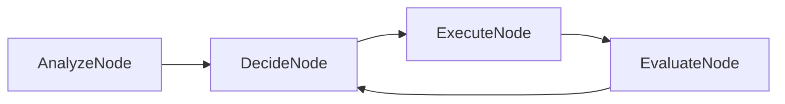

# PocketChain Multi-Step Agent

A sophisticated multi-step agent that can perform complex tasks by breaking them down into smaller actions using PocketChain.

## What it does

This agent can:
- Analyze complex tasks and break them down into steps
- Make decisions about which actions to take
- Execute multiple actions in sequence
- Learn from previous actions and adapt its approach
- Handle errors and retry with different strategies
- Provide detailed reasoning for its decisions

## Architecture

The agent uses a decision-making loop with multiple nodes:
1. **AnalyzeNode**: Analyzes the task and determines required actions
2. **DecideNode**: Decides which action to take next
3. **ExecuteNode**: Executes the chosen action
4. **EvaluateNode**: Evaluates the result and determines next steps



## Features

- **Task Analysis**: Breaks down complex tasks into manageable steps
- **Dynamic Decision Making**: Chooses actions based on current context
- **Action Execution**: Performs various types of actions (search, calculate, etc.)
- **Result Evaluation**: Assesses outcomes and adjusts strategy
- **Error Recovery**: Handles failures and tries alternative approaches
- **Progress Tracking**: Maintains state across multiple steps

## Quick Start

1. **Install dependencies**:
   ```bash
   npm install
   ```

2. **Set up environment**:
   ```bash
   cp env.example .env
   # Edit .env and add your OpenAI API key
   ```

3. **Run the agent**:
   ```bash
   npm start
   ```

4. **Give it a complex task**:
   ```
   Task: Research the latest developments in quantum computing and create a summary
   Agent: I'll help you research quantum computing developments. Let me break this down into steps...
   ```

## Usage Examples

### Research Tasks
```
Task: Find information about renewable energy trends in 2024
Agent: I'll research renewable energy trends by:
1. Searching for recent reports and articles
2. Analyzing key statistics and data
3. Identifying major trends and developments
4. Creating a comprehensive summary
```

### Problem Solving
```
Task: Help me plan a budget for a small business
Agent: I'll help you create a business budget by:
1. Gathering information about your business type
2. Researching typical expenses for similar businesses
3. Creating a budget template
4. Providing recommendations for cost optimization
```

### Creative Tasks
```
Task: Design a marketing strategy for a new product
Agent: I'll design a marketing strategy by:
1. Researching your target market
2. Analyzing competitor strategies
3. Identifying unique selling points
4. Creating a comprehensive marketing plan
```

## Configuration

### Environment Variables

- `OPENAI_API_KEY`: Your OpenAI API key (required)
- `OPENAI_MODEL`: Model to use (default: "gpt-4")
- `MAX_STEPS`: Maximum number of steps per task (default: 10)
- `THINKING_TIME`: Time to think between steps in milliseconds (default: 1000)

### Customization

You can modify the agent behavior by editing:
- `src/nodes.ts`: Change how the agent analyzes and decides
- `src/flow.ts`: Modify the agent's decision loop
- `src/utils/actions.ts`: Add new action types

## Project Structure

```
pocketchain-agent/
├── README.md              # This file
├── package.json           # Dependencies and scripts
├── env.example           # Environment variables template
├── src/
│   ├── main.ts           # Entry point
│   ├── nodes.ts          # Node definitions
│   ├── flow.ts           # Flow orchestration
│   └── utils/
│       ├── llm.ts        # LLM utility functions
│       └── actions.ts    # Action execution utilities
├── data/
│   ├── tasks/            # Task history and results
│   └── knowledge/        # Agent knowledge base
└── sample-tasks.txt      # Sample tasks for testing
```

## API Reference

### AnalyzeNode
- **Purpose**: Analyzes tasks and determines required actions
- **Input**: User task description
- **Output**: Task breakdown and action plan

### DecideNode
- **Purpose**: Decides which action to take next
- **Input**: Current context and available actions
- **Output**: Chosen action and reasoning

### ExecuteNode
- **Purpose**: Executes the chosen action
- **Input**: Action description and parameters
- **Output**: Action result

### EvaluateNode
- **Purpose**: Evaluates results and determines next steps
- **Input**: Action result and current context
- **Output**: Next action decision or completion

## Troubleshooting

### Common Issues

1. **"Agent stuck in loop"**
   - The agent has a maximum step limit to prevent infinite loops
   - Check the task complexity and try breaking it down

2. **"Action execution failed"**
   - The agent will try alternative approaches
   - Check if the required tools or APIs are available

3. **"Task too complex"**
   - Try breaking the task into smaller, more specific parts
   - The agent works best with well-defined objectives

### Debug Mode

Run with debug logging:
```bash
DEBUG=true npm start
```

## Extending the Agent

### Adding New Actions

1. **Database operations**: Add actions for database queries and updates
2. **File operations**: Add actions for reading and writing files
3. **API integrations**: Add actions for calling external APIs
4. **Custom tools**: Add domain-specific tools and actions

### Example: Adding a Calculator Action

```typescript
// In src/utils/actions.ts
export async function calculateAction(expression: string): Promise<string> {
  try {
    // Safe evaluation of mathematical expressions
    const result = eval(expression);
    return `Calculation result: ${result}`;
  } catch (error) {
    return `Error calculating: ${error.message}`;
  }
}
```

## Agent Capabilities

### Current Actions
- **Search**: Web search for information
- **Analyze**: Analyze data and text
- **Summarize**: Create summaries of content
- **Plan**: Create plans and strategies
- **Research**: Conduct research on topics

### Planned Actions
- **Calculate**: Perform mathematical calculations
- **Write**: Generate written content
- **Design**: Create designs and layouts
- **Code**: Write and debug code
- **Translate**: Translate between languages

## License

This example is provided under the MIT license. 