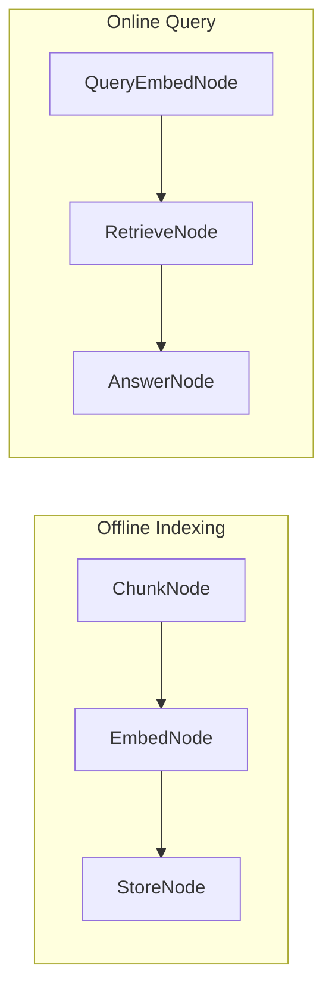

# PocketChain RAG System

A Retrieval-Augmented Generation (RAG) system that can answer questions based on your own documents using PocketChain.

## What it does

This RAG system can:
- Process and index your documents (PDFs, text files, etc.)
- Chunk documents into manageable pieces
- Generate embeddings for semantic search
- Retrieve relevant context for questions
- Generate accurate answers based on your documents
- Provide source citations

## Architecture

The RAG system uses a two-stage approach:

### Stage 1: Offline Indexing
1. **ChunkNode**: Splits documents into chunks
2. **EmbedNode**: Generates embeddings for each chunk
3. **StoreNode**: Stores embeddings in a simple in-memory index

### Stage 2: Online Query & Answer
1. **QueryEmbedNode**: Embeds the user's question
2. **RetrieveNode**: Finds most relevant chunks
3. **AnswerNode**: Generates answers with context



## Features

- **Document Processing**: Handles multiple document formats
- **Semantic Search**: Uses embeddings for better retrieval
- **Context-Aware Answers**: Generates answers based on retrieved context
- **Source Citations**: Provides references to source documents
- **Simple Storage**: Uses in-memory storage (can be extended to databases)

## Quick Start

1. **Install dependencies**:
   ```bash
   npm install
   ```

2. **Set up environment**:
   ```bash
   cp env.example .env
   # Edit .env and add your OpenAI API key
   ```

3. **Add your documents**:
   ```bash
   # Copy your documents to the data/documents/ folder
   cp your-document.pdf data/documents/
   ```

4. **Index your documents**:
   ```bash
   npm run index
   ```

5. **Start the RAG system**:
   ```bash
   npm start
   ```

6. **Ask questions**:
   ```
   Question: What are the main features of the product?
   Answer: Based on the documentation, the main features include...
   ```

## Usage Examples

### Document Q&A
```
Question: What is the company's refund policy?
Answer: According to the customer service document, the company offers a 30-day money-back guarantee...
```

### Technical Documentation
```
Question: How do I configure the API authentication?
Answer: The API documentation states that authentication requires...
```

### Research Papers
```
Question: What were the key findings of the study?
Answer: The research paper found that...
```

## Configuration

### Environment Variables

- `OPENAI_API_KEY`: Your OpenAI API key (required)
- `OPENAI_MODEL`: Model to use (default: "gpt-3.5-turbo")
- `MAX_TOKENS`: Maximum response length (default: 400)
- `CHUNK_SIZE`: Size of document chunks (default: 1000 characters)
- `TOP_K`: Number of chunks to retrieve (default: 3)

### Customization

You can modify the RAG behavior by editing:
- `src/nodes.ts`: Change how documents are processed and answers generated
- `src/flow.ts`: Modify the indexing and query flows
- `src/utils/embedding.ts`: Switch to a different embedding model

## Project Structure

```
pocketchain-rag/
├── README.md              # This file
├── package.json           # Dependencies and scripts
├── env.example           # Environment variables template
├── src/
│   ├── main.ts           # Entry point
│   ├── index.ts          # Indexing script
│   ├── nodes.ts          # Node definitions
│   ├── flow.ts           # Flow orchestration
│   └── utils/
│       ├── llm.ts        # LLM utility functions
│       ├── embedding.ts  # Embedding utilities
│       └── documents.ts  # Document processing utilities
├── data/
│   ├── documents/        # Your documents go here
│   ├── chunks/           # Generated chunks
│   ├── embeddings/       # Generated embeddings
│   └── index.json        # Search index
└── sample-documents/     # Sample documents for testing
```

## API Reference

### Indexing Nodes

#### ChunkNode
- **Purpose**: Splits documents into chunks
- **Input**: Document content
- **Output**: Array of text chunks

#### EmbedNode
- **Purpose**: Generates embeddings for chunks
- **Input**: Text chunks
- **Output**: Embedding vectors

#### StoreNode
- **Purpose**: Stores embeddings in searchable index
- **Input**: Embeddings and chunks
- **Output**: Search index

### Query Nodes

#### QueryEmbedNode
- **Purpose**: Embeds user questions
- **Input**: Question text
- **Output**: Question embedding

#### RetrieveNode
- **Purpose**: Finds relevant chunks
- **Input**: Question embedding and index
- **Output**: Relevant chunks

#### AnswerNode
- **Purpose**: Generates answers with context
- **Input**: Question and relevant chunks
- **Output**: Final answer with citations

## Troubleshooting

### Common Issues

1. **"No documents found"**
   - Make sure you've added documents to `data/documents/`
   - Run `npm run index` to process documents

2. **"Embedding generation failed"**
   - Check your OpenAI API key and quota
   - The system includes retry logic for API failures

3. **"No relevant chunks found"**
   - Try rephrasing your question
   - Check if your documents contain relevant information

### Debug Mode

Run with debug logging:
```bash
DEBUG=true npm start
```

## Extending the RAG System

### Adding New Features

1. **Database Storage**: Replace in-memory storage with PostgreSQL or Pinecone
2. **Multiple Document Types**: Add support for Word docs, PowerPoint, etc.
3. **Hybrid Search**: Combine semantic and keyword search
4. **Web Interface**: Add a simple web UI for document upload and querying

### Example: Adding Database Storage

```typescript
// In src/utils/storage.ts
export class DatabaseStorage {
  async storeEmbeddings(embeddings: any[]): Promise<void> {
    // Store in PostgreSQL or vector database
  }
  
  async searchSimilar(embedding: number[], topK: number): Promise<any[]> {
    // Search database for similar embeddings
  }
}
```

## License

This example is provided under the MIT license. 