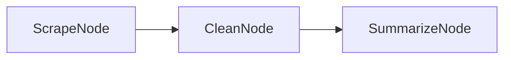

# PocketChain Web Scraper

A web scraper that extracts and summarizes content from websites using PocketChain.

## What it does

This web scraper can:
- Extract content from web pages
- Clean and process HTML content
- Summarize extracted content using LLMs
- Handle multiple URLs in batch
- Generate structured summaries with key insights
- Save results to files

## Architecture

The scraper uses a three-node flow:
1. **ScrapeNode**: Extracts content from web pages
2. **CleanNode**: Cleans and processes the extracted content
3. **SummarizeNode**: Generates summaries using LLMs



## Features

- **Web Scraping**: Extracts text content from web pages
- **Content Cleaning**: Removes HTML tags and unnecessary content
- **Intelligent Summarization**: Uses LLMs to create meaningful summaries
- **Batch Processing**: Can process multiple URLs at once
- **Error Handling**: Graceful handling of network errors and invalid URLs
- **Rate Limiting**: Built-in delays to be respectful to websites

## Quick Start

1. **Install dependencies**:
   ```bash
   npm install
   ```

2. **Set up environment**:
   ```bash
   cp env.example .env
   # Edit .env and add your OpenAI API key
   ```

3. **Run the scraper**:
   ```bash
   npm start
   ```

4. **Enter URLs to scrape**:
   ```
   Enter URL: https://example.com/article
   Processing...
   Summary: This article discusses...
   ```

## Usage Examples

### Single URL Scraping
```
Enter URL: https://techcrunch.com/2024/01/15/ai-startup-funding
Processing...
Summary: The article reports on recent funding rounds in the AI startup space...
```

### Batch Processing
```
Enter URLs (comma-separated): https://example1.com, https://example2.com
Processing 2 URLs...
URL 1 Summary: ...
URL 2 Summary: ...
```

### Content Analysis
```
Enter URL: https://research-paper.com/study
Processing...
Summary: This research paper examines the effects of...
Key Findings: 1. ... 2. ... 3. ...
```

## Configuration

### Environment Variables

- `OPENAI_API_KEY`: Your OpenAI API key (required)
- `OPENAI_MODEL`: Model to use (default: "gpt-3.5-turbo")
- `MAX_TOKENS`: Maximum response length (default: 500)
- `SCRAPE_DELAY`: Delay between requests in milliseconds (default: 1000)
- `MAX_CONTENT_LENGTH`: Maximum content length to process (default: 10000)

### Customization

You can modify the scraper behavior by editing:
- `src/nodes.ts`: Change how content is scraped and summarized
- `src/flow.ts`: Modify the scraping flow
- `src/utils/scraper.ts`: Switch to different scraping libraries

## Project Structure

```
pocketchain-scraper/
├── README.md              # This file
├── package.json           # Dependencies and scripts
├── env.example           # Environment variables template
├── src/
│   ├── main.ts           # Entry point
│   ├── nodes.ts          # Node definitions
│   ├── flow.ts           # Flow orchestration
│   └── utils/
│       ├── llm.ts        # LLM utility functions
│       └── scraper.ts    # Web scraping utilities
├── data/
│   ├── scraped/          # Scraped content files
│   └── summaries/        # Generated summaries
└── sample-urls.txt       # Sample URLs for testing
```

## API Reference

### ScrapeNode
- **Purpose**: Extracts content from web pages
- **Input**: URL to scrape
- **Output**: Raw HTML content

### CleanNode
- **Purpose**: Cleans and processes extracted content
- **Input**: Raw HTML content
- **Output**: Clean text content

### SummarizeNode
- **Purpose**: Generates summaries using LLMs
- **Input**: Clean text content
- **Output**: Structured summary

## Troubleshooting

### Common Issues

1. **"Network error"**
   - Check your internet connection
   - The scraper includes retry logic for network failures

2. **"Invalid URL"**
   - Make sure the URL is properly formatted
   - Include the protocol (http:// or https://)

3. **"Content too long"**
   - The scraper has a maximum content length limit
   - You can adjust this in the environment variables

### Debug Mode

Run with debug logging:
```bash
DEBUG=true npm start
```

## Extending the Scraper

### Adding New Features

1. **Image extraction**: Extract and analyze images from web pages
2. **PDF scraping**: Add support for scraping PDF documents
3. **Social media**: Add support for scraping social media posts
4. **Database storage**: Save results to a database instead of files

### Example: Adding Image Analysis

```typescript
// In src/nodes.ts
class ImageExtractNode extends Node {
  async exec(url: string): Promise<any> {
    // Extract images from the page
    const images = await extractImages(url);
    return images;
  }
}
```

## Ethical Considerations

- **Respect robots.txt**: Always check and respect website robots.txt files
- **Rate limiting**: Use delays between requests to avoid overwhelming servers
- **Terms of service**: Ensure you comply with website terms of service
- **Data usage**: Be mindful of how you use scraped data

## License

This example is provided under the MIT license. 