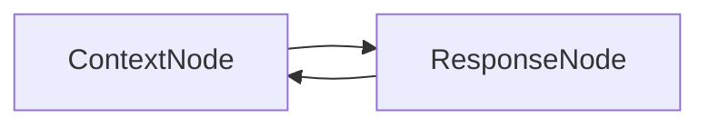

# PocketFlow-Node Chatbot

A simple conversational chatbot that demonstrates basic conversation flow and context management using PocketFlow-Node.

## What it does

This chatbot can:
- Handle basic Q&A conversations
- Maintain conversation context across multiple turns
- Provide helpful responses to common questions
- Remember previous interactions in the same session

## Architecture

The chatbot uses a simple two-node flow:
1. **ContextNode**: Prepares conversation context from previous messages
2. **ResponseNode**: Generates appropriate responses using the LLM



## Features

- **Context Management**: Remembers conversation history
- **Natural Responses**: Uses LLM for human-like responses
- **Session Persistence**: Maintains state across multiple interactions
- **Error Handling**: Graceful fallbacks for API failures

## Quick Start

1. **Install dependencies**:
   ```bash
   npm install
   ```

2. **Set up environment**:
   ```bash
   cp .env.example .env
   # Edit .env and add your OpenAI API key
   ```

3. **Run the chatbot**:
   ```bash
   npm start
   ```

4. **Start chatting**:
   ```
   You: Hello, how are you?
   Bot: Hello! I'm doing well, thank you for asking. How can I help you today?
   
   You: What's the weather like?
   Bot: I don't have access to real-time weather information, but I'd be happy to help you with other questions or have a conversation about various topics!
   ```

## Usage Examples

### Basic Conversation
```
You: Hi there!
Bot: Hello! It's great to meet you. How can I assist you today?

You: Tell me a joke
Bot: Here's a light-hearted one for you: Why don't scientists trust atoms? Because they make up everything! 😄
```

### Context Awareness
```
You: My name is Alice
Bot: Nice to meet you, Alice! It's great to make your acquaintance.

You: What's my name?
Bot: Your name is Alice! I remember you mentioned that earlier in our conversation.
```

## Configuration

### Environment Variables

- `OPENAI_API_KEY`: Your OpenAI API key (required)
- `OPENAI_MODEL`: Model to use (default: "gpt-3.5-turbo")

### Customization

You can modify the chatbot behavior by editing:
- `src/nodes.ts`: Change how responses are generated
- `src/flow.ts`: Modify the conversation flow
- `src/utils/llm.ts`: Switch to a different LLM provider

## Project Structure

```
pocketflow-node-chatbot/
├── README.md              # This file
├── package.json           # Dependencies and scripts
├── .env.example          # Environment variables template
├── src/
│   ├── main.ts           # Entry point
│   ├── nodes.ts          # Node definitions
│   ├── flow.ts           # Flow orchestration
│   └── utils/
│       └── llm.ts        # LLM utility functions
└── data/
    └── conversation.json  # Sample conversation data
```

## API Reference

### ContextNode
- **Purpose**: Prepares conversation context
- **Input**: Shared store with conversation history
- **Output**: Formatted context string for LLM

### ResponseNode
- **Purpose**: Generates chatbot responses
- **Input**: Conversation context
- **Output**: Natural language response

## Troubleshooting

### Common Issues

1. **"API key not found"**
   - Make sure you've set `OPENAI_API_KEY` in your `.env` file

2. **"Rate limit exceeded"**
   - The chatbot includes retry logic, but you may need to wait if you hit OpenAI's rate limits

3. **"Model not found"**
   - Check that the model name in your `.env` file is correct

### Debug Mode

Run with debug logging:
```bash
DEBUG=true npm start
```

## Extending the Chatbot

### Adding New Features

1. **Multi-turn conversations**: Modify the context preparation to include more history
2. **Personality**: Add personality traits to the system prompt
3. **Memory**: Implement persistent storage for conversation history
4. **Web interface**: Add a simple web UI using Express.js

### Example: Adding Personality

```typescript
// In src/nodes.ts
class ResponseNode extends Node {
  exec(context: string): string {
    const prompt = `You are a friendly and helpful assistant named PocketBot. 
    You love to make jokes and always try to be encouraging.
    
    Context: ${context}
    
    Respond naturally and in character:`;
    
    return callLLM(prompt);
  }
}
```

## License

This example is provided under the MIT license. 