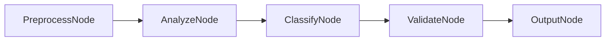

# PocketFlow-Node Text Classifier

A text classification system that can categorize documents and emails using PocketFlow-Node.

## What it does

This classifier can:
- Categorize text into predefined categories
- Classify emails by type (spam, important, newsletter, etc.)
- Categorize documents by topic or genre
- Analyze sentiment (positive, negative, neutral)
- Detect language and content type
- Provide confidence scores for classifications
- Handle multiple classification tasks simultaneously

## Architecture

The classifier uses a multi-stage classification flow:
1. **PreprocessNode**: Cleans and prepares text for classification
2. **AnalyzeNode**: Analyzes text features and patterns
3. **ClassifyNode**: Performs the actual classification
4. **ValidateNode**: Validates and refines classifications
5. **OutputNode**: Formats and presents results



## Features

- **Multi-category Classification**: Supports multiple classification schemes
- **Email Classification**: Spam detection, priority classification
- **Document Categorization**: Topic-based document organization
- **Sentiment Analysis**: Positive, negative, neutral sentiment detection
- **Language Detection**: Identifies text language
- **Confidence Scoring**: Provides confidence levels for classifications
- **Batch Processing**: Handles multiple texts efficiently

## Quick Start

1. **Install dependencies**:
   ```bash
   npm install
   ```

2. **Set up environment**:
   ```bash
   cp env.example .env
   # Edit .env and add your OpenAI API key
   ```

3. **Run the classifier**:
   ```bash
   npm start
   ```

4. **Classify text**:
   ```
   Enter text: "This is an urgent email about a meeting tomorrow"
   Classifying...
   Result: Category: Important Email, Confidence: 95%
   ```

## Usage Examples

### Email Classification
```
Text: "URGENT: Meeting tomorrow at 2 PM"
Classification: Important Email
Confidence: 95%
Reasoning: Contains urgent language and meeting details

Text: "Win a free iPhone! Click here now!"
Classification: Spam
Confidence: 98%
Reasoning: Contains typical spam indicators
```

### Document Categorization
```
Text: "The latest developments in quantum computing..."
Classification: Technology
Confidence: 92%
Subcategories: Research, Scientific

Text: "Stock market analysis for Q4 2024..."
Classification: Finance
Confidence: 89%
Subcategories: Investment, Market Analysis
```

### Sentiment Analysis
```
Text: "I love this product! It's amazing!"
Sentiment: Positive
Confidence: 96%
Intensity: Strong

Text: "This service is terrible and I want a refund"
Sentiment: Negative
Confidence: 94%
Intensity: Strong
```

## Configuration

### Environment Variables

- `OPENAI_API_KEY`: Your OpenAI API key (required)
- `OPENAI_MODEL`: Model to use (default: "gpt-3.5-turbo")
- `CLASSIFICATION_TYPES`: Available classification schemes
- `CONFIDENCE_THRESHOLD`: Minimum confidence for classification (default: 0.7)

### Customization

You can modify the classifier behavior by editing:
- `src/nodes.ts`: Change how text is classified
- `src/flow.ts`: Modify the classification flow
- `src/utils/categories.ts`: Define custom categories

## Project Structure

```
pocketflow-node-classifier/
├── README.md              # This file
├── package.json           # Dependencies and scripts
├── env.example           # Environment variables template
├── src/
│   ├── main.ts           # Entry point
│   ├── nodes.ts          # Node definitions
│   ├── flow.ts           # Flow orchestration
│   └── utils/
│       ├── llm.ts        # LLM utility functions
│       ├── categories.ts # Classification categories
│       └── preprocess.ts # Text preprocessing utilities
├── data/
│   ├── input/            # Text files to classify
│   ├── output/           # Classification results
│   └── training/         # Training data (if applicable)
└── categories/           # Category definitions
```

## API Reference

### PreprocessNode
- **Purpose**: Cleans and prepares text for classification
- **Input**: Raw text
- **Output**: Cleaned and normalized text

### AnalyzeNode
- **Purpose**: Analyzes text features and patterns
- **Input**: Cleaned text
- **Output**: Text analysis and features

### ClassifyNode
- **Purpose**: Performs the actual classification
- **Input**: Text analysis and classification parameters
- **Output**: Classification results with confidence scores

### ValidateNode
- **Purpose**: Validates and refines classifications
- **Input**: Initial classification results
- **Output**: Validated and refined classifications

### OutputNode
- **Purpose**: Formats and presents results
- **Input**: Final classification results
- **Output**: Formatted classification report

## Troubleshooting

### Common Issues

1. **"Low confidence classification"**
   - The text may be ambiguous or unclear
   - Try providing more context or clearer text

2. **"Classification not matching expectations"**
   - Check if the text fits the expected categories
   - Consider adding custom categories for your use case

3. **"Text too short/long"**
   - Very short texts may lack context
   - Very long texts may need to be summarized first

### Debug Mode

Run with debug logging:
```bash
DEBUG=true npm start
```

## Extending the Classifier

### Adding New Features

1. **Custom categories**: Define domain-specific categories
2. **Multi-language support**: Classify text in different languages
3. **Real-time classification**: Process streaming text
4. **Training data**: Use custom training data for better accuracy

### Example: Adding Custom Categories

```typescript
// In src/utils/categories.ts
export const CUSTOM_CATEGORIES = {
  'customer-support': {
    name: 'Customer Support',
    description: 'Customer service related content',
    keywords: ['help', 'support', 'customer', 'service']
  },
  'product-feedback': {
    name: 'Product Feedback',
    description: 'User feedback about products',
    keywords: ['feedback', 'review', 'rating', 'product']
  }
};
```

## Classification Types

### Email Classification
- **Important**: Urgent or high-priority emails
- **Spam**: Unwanted or suspicious emails
- **Newsletter**: Marketing or informational emails
- **Personal**: Personal correspondence
- **Work**: Work-related communications

### Document Categories
- **Technology**: Tech-related content
- **Finance**: Financial and business content
- **Health**: Health and medical content
- **Education**: Educational content
- **Entertainment**: Entertainment and leisure content

### Sentiment Analysis
- **Positive**: Favorable sentiment
- **Negative**: Unfavorable sentiment
- **Neutral**: Neutral or mixed sentiment

## Performance Optimization

### Tips for Better Classification
- **Clear text**: Use clear, well-written text
- **Adequate length**: Provide enough context (50-500 words ideal)
- **Relevant categories**: Choose appropriate classification schemes
- **Consistent formatting**: Use consistent text formatting

### Batch Processing
For multiple texts, the classifier can process them in batches for better efficiency. Use the batch mode for processing large volumes of text.

## License

This example is provided under the MIT license. 